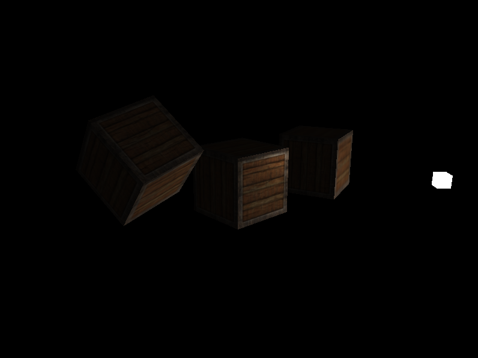

# Egen

Baisc C++ OpenGL 3D Game Engine.

*Work in progress*

## Dependencies

```
build-essential
cmake
pkg-config
libglfw3-dev
libglm-dev
libgl1-mesa-dev
libx11-dev
libxi-dev
libxrandr-dev
libxinerama-dev
libxcursor-dev
libxkbcommon-dev
libwayland-dev
```

## Build

```sh
git submodule update --init
mkdir build
cd build
cmake ..
make
```

## Features

| State | Name                                  | Description                                           |
|-------|---------------------------------------|-------------------------------------------------------|
|  ✅   | Window Component                      | Component to draw Window and handle key/mouse input   |
|  ✅   | Shader Component                      | Component to load & compile shaders                   |
|  ✅   | Basic Renderer                        | Render Basic VAOs, and handle model matrices          |
|  ✅   | Camera                                | Camera that handles projection and movement           |
|  ✅   | Textures                              | Texture support                                       |
|  ☑️   | Basic Lighting                        | Support for colors, materials, light maps, etc        |
|       | Model Loading                         | Support for loading models (ex: gltf)                 |
|       | Complex Object component              | Object component with  hierarchical modeling          |
|       | ECS                                   | Entity Component System                               |
|       | Render Components                     | Embed render systems into ECS components              |
|       | Control Components                    | Entity movement components                            |
|       | Basic Physics system and components   | Add basic collisions, gravity, and physics components |
|       | Advanced Physics systems              | ...                                                   |
|       | Advanced Lighting                     | Shadows, HDR, etc                                     |

